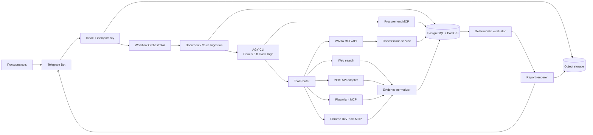
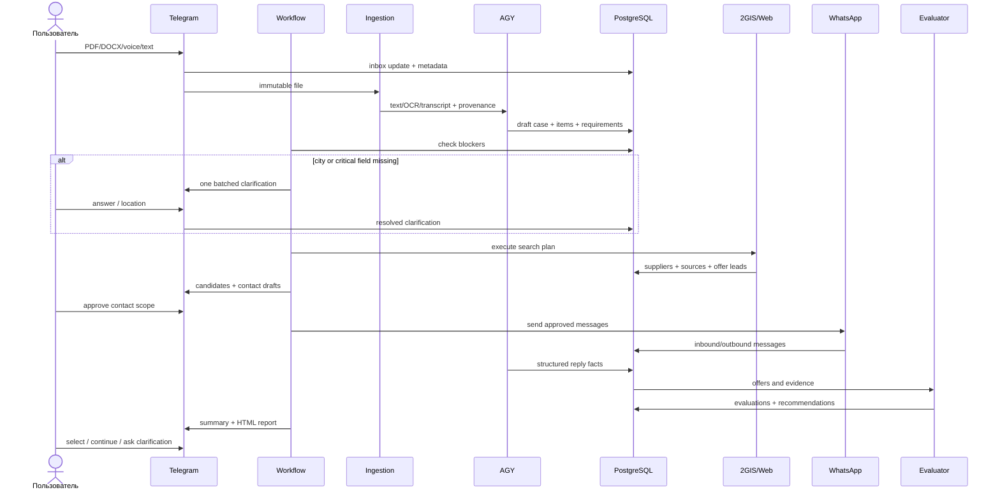
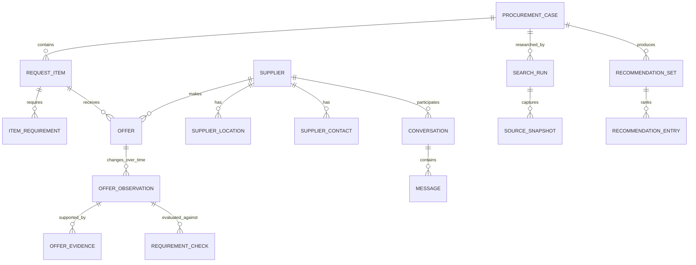

# Архитектура автономного агента закупок: Telegram + AGY + PostgreSQL + 2GIS/Web + WhatsApp

**Версия:** 1.0
**Дата:** 22 сентября 2026 года
**Статус:** целевая архитектура и исполняемое foundation-ядро; обновлено 23 сентября 2026 года
**Целевая среда:** один Linux-сервер на старте с возможностью дальнейшего разделения сервисов

---

## Статус реализации

Исполняемое ядро находится в `src/procurement_bot`: Telegram ingress, durable jobs/outbox,
private attachment storage, PDF/DOCX/voice extraction, изолированный AGY intake,
deterministic clarifications и versioned case projection. Второй foundation-срез добавляет
research/locality plan, read-only browser contract, supplier/evidence/offer persistence,
approval-gated WAHA boundary, bounded dialogue policy, deterministic evaluation и безопасный
HTML renderer. Добавлены append-only conversation/webhook ledger, повторная delivery-time
проверка approval, Decimal-only pack/MOQ/VAT/delivery costing и versioned report artifacts.
Research approval UI и атомарные переходы `ready → researching` подключены, а кнопка запуска
fail-closed скрывается без live executor. Реализован конфигурируемый AGY browser executor с
отдельным HOME/одним MCP и end-to-end research worker, сохраняющий доказательства и кандидатов.
Готовый research run автоматически строит private HTML и доставляет файл в Telegram. Supplier
reply привязан к точным позициям, а следующий WhatsApp-текст требует отдельной callback-кнопки
и повторной delivery-time проверки. Добавлены evidence-backed purchase/accounting таблицы,
read-only case queries, водители и shared-delivery allocations, RU/KZ voice gate и двуязычные
supplier templates. Внешний smoke-test browser-профиля, первый contact-campaign UI, OCR чеков,
media replies и публичный TLS reverse proxy всё ещё требуют следующего среза.

---

## 1. Решение в одном абзаце

Система строится не как один бесконечный AGY-процесс, а как надёжный workflow вокруг PostgreSQL. Telegram принимает PDF, DOCX, текст, голос и геопозицию. Сервис извлечения сохраняет оригинал и распознаёт содержимое. AGY с `gemini-3.8-flash-high` превращает запрос в строгую структуру, выявляет недостающие данные и задаёт минимальные уточнения. После подтверждения города и зоны поиска планировщик запускает поиск по собственной базе, официальному 2GIS Places API при наличии лицензированного ключа, 2GIS через Playwright MCP и обычному вебу. Все поставщики, источники, предложения, переписка и доказательства сохраняются в PostgreSQL. После однократного разрешения пользователя агент может вести ограниченный диалог с продавцами через WAHA, не раскрывая тендерную цену и не принимая обязательств. Детерминированный модуль проверяет ТЗ, полную себестоимость и риски, а бот возвращает в Telegram короткий итог и версионированный HTML-отчёт с топ-вариантами.

Ключевой принцип:

> AGY рассуждает и предлагает действия; workflow-сервис хранит состояние, проверяет правила и исполняет разрешённые действия.

---

## 2. Что именно должна уметь система

### 2.1. Входы

- PDF с одной или несколькими позициями закупки;
- DOCX с текстом, таблицами и изображениями;
- сканы и фотографии внутри PDF/DOCX;
- голосовое сообщение Telegram;
- обычный текст;
- Telegram Location или ссылка на карту;
- продолжение уже существующей заявки: «добавь ещё 20 метров», «поищи теперь на первой Алмате».

### 2.2. Обязательное поведение

1. Извлечь позиции, количества, единицы, обязательные параметры, допустимость аналогов, город, адрес поставки, срок, НДС и требования к документам.
2. Не домысливать отсутствующие обязательные данные.
3. Если город отсутствует — спросить город до начала локального поиска.
4. Если неясна зона поиска — предложить варианты:
   - весь город;
   - конкретный район/рынок;
   - интернет с доставкой;
   - комбинация источников.
5. Понимать локальные обозначения и разговорные названия мест. Если значение не доказано, сначала найти объяснение в интернете/2GIS; при неоднозначности — спросить пользователя.
6. Систематически искать поставщиков, а не останавливаться после первых результатов.
7. Разделять факт существования магазина и факт наличия конкретного товара. Карточка 2GIS подтверждает организацию, но не наличие товара.
8. Создавать отдельную карточку поставщика и отдельное датированное наблюдение предложения.
9. Не использовать тендерную цену как поисковый фильтр и не сообщать её продавцу.
10. Проверять техническое соответствие раньше сравнения цены.
11. Представлять рекомендацию, но не оформлять покупку, оплату, резерв или обязательство без отдельного подтверждения пользователя.
12. Отправлять пользователю понятный Telegram-итог и HTML-отчёт.

### 2.3. Что система не должна делать автоматически

- оплачивать товар;
- соглашаться на резерв, договор или заказ;
- отправлять ИИН, БИН, удостоверения, банковские реквизиты или иные чувствительные сведения без явного сценария;
- соглашаться на замену товара, если аналог требует согласования;
- обходить CAPTCHA, ограничения доступа или защиту сайта;
- собирать скрытые персональные данные;
- объявлять предложение точным совпадением без доказательства обязательных параметров;
- считать неизвестную цену, количество или логистику равными нулю.

---

## 3. Что найдено в существующем проекте и Notion

В разделе Notion «Максим» уже есть семь полезных сущностей:

| Текущая база | Смысл | Целевая сущность PostgreSQL |
|---|---|---|
| Тендера | закупочный кейс, клиент, город, сумма, НДС | `procurement_cases` |
| Заявки | отдельная строка ТЗ и её исполнение | `request_items`, `item_requirements`, `fulfillment_events` |
| Поставщики | постоянная карточка контрагента | `suppliers`, `supplier_contacts`, `supplier_locations` |
| Предложения | кандидат по строке и поставщику | `offers`, `offer_observations`, `offer_evidence` |
| Клиенты | школы/получатели и контакты | `customers`, `customer_locations`, `customer_contacts` |
| Грузоперевозки | перевозчик, маршрут, стоимость и накладная | `shipments`, `carriers`, `shipment_documents` |
| Камеры хранения | промежуточное место хранения | `storage_locations`, `storage_stays` |

Сильные стороны текущей модели, которые нужно сохранить:

- явные связи заявка → предложение → поставщик;
- выбранное предложение отделено от списка кандидатов;
- статусы технического соответствия;
- уровни доказательств;
- поля «Что подтвердить», «Доказательства» и «Сообщение поставщику»;
- фактическая цена и дата закупки отделены от предварительной оценки;
- логистика, документы и НДС учитываются отдельно;
- имеется естественный «Ключ наблюдения».

Проблемы, которые PostgreSQL должен устранить:

- rollup/formula-поля выглядят как данные, хотя являются производными;
- в одной колонке «Доп. статус» смешаны закупка, доставка, проблемы и следующие действия;
- карточка заявки хранит одновременно исходное ТЗ, текущее состояние, финансовые формулы и фактическую приёмку;
- поставщики привязаны к конкретным заявкам, хотя карточка поставщика должна быть постоянной;
- часть значений является разовой заметкой, а не воспроизводимым событием;
- история изменения цены/наличия перезаписывается вместо хранения наблюдений;
- города и районы заданы закрытыми select-списками, что плохо масштабируется;
- неизвестное и отрицательное значение местами трудно различить.

Локальный проект уже содержит хороший эталон контроля качества:

- дедупликация по телефону, WhatsApp, 2GIS firm ID и `название + адрес`;
- запрет считать обычный телефон подтверждённым WhatsApp;
- четыре статуса технической пригодности;
- проверка обязательного источника 2GIS;
- реестр поставщиков с доказательством релевантности и вопросом продавцу;
- отдельный список удалённых дублей;
- правило, что 2GIS подтверждает магазин, а не товар.

Эти правила должны стать не только промптом, но и кодовыми инвариантами базы и валидатора.

---

## 4. Архитектурные принципы

1. **PostgreSQL — источник истины.** История чата и память модели не считаются состоянием процесса.
2. **Оригинал неизменяем.** Полученный файл, исходное сообщение и ответ продавца сохраняются до интерпретации.
3. **Любой факт имеет происхождение.** Для цены, наличия, характеристики и контакта хранятся источник, время, способ получения и уровень доверия.
4. **LLM не пишет произвольный SQL.** AGY работает только через типизированные инструменты внутреннего MCP/API.
5. **Сначала жёсткие ограничения, потом цена.** Несоответствующий ТЗ дешёвый товар не становится лучшим.
6. **Наблюдения append-only.** Новая цена или новый ответ создают новую запись, а не уничтожают старую.
7. **Внешние действия имеют разрешение.** Поиск и чтение разрешены; отправка сообщений проходит через approval policy; покупка всегда остаётся у человека.
8. **Идемпотентность по умолчанию.** Повтор Telegram update, webhook или retry не должен создавать дубль или повторно отправлять сообщение.
9. **Инструменты подключаются по этапу.** Модель не получает одновременно все браузерные, WhatsApp и административные инструменты.
10. **Неопределённость является данными.** Используются `NULL`, confidence, «не проверено» и открытый вопрос, а не выдуманное значение.

### 4.1. Что переиспользуется из локальных проектов

Дополнительно были разобраны два работающих локальных проекта:

- `/home/moses/tg_bot_floorball_site`;
- `/home/moses/audio_transcription`.

Оба подтверждают, что для этого проекта не нужен новый инфраструктурный каркас с нуля. Их общая база уже близка к требуемой: `aiogram 3`, `asyncpg`, PostgreSQL inbox/jobs/outbox, отдельный worker, Pydantic-контракты, AGY subprocess и systemd deployment.

| Источник | Классификация | Что использовать |
|---|---|---|
| `audio_transcription` целиком | fork base после очистки домена | Telegram transport, двухфазная обработка media, локальный Bot API, FFmpeg/FFprobe, chunk manifests, leased jobs, heartbeat, worker concurrency, HTML/document delivery |
| `tg_bot_floorball_site` целиком | reference only | домен сайта и публикации слишком специфичен, но архитектурные шаблоны сильные |
| `floorball_bot/queue.py` | использовать напрямую с переименованием | stable idempotency key, `SKIP LOCKED`, retry/backoff, outbox |
| `transcription_bot/audio_chunks.py` | использовать напрямую с тестами | детерминированная нарезка длинного аудио, проверка длительности/размера |
| Floorball dialogue specs/evaluator | fork base | версионированная анкета, детерминированный поиск пропусков, минимальный следующий вопрос |
| Floorball `AgyExtractor` | fork base | sandbox, temporary cwd, строгая JSON Schema, trusted/untrusted envelope, bounded output/timeout |
| Audio `AgyStructurer` без изменений | отклонить | использует `--dangerously-skip-permissions` и передаёт `HOME`; для procurement это избыточный риск |
| AssemblyAI-specific pipeline | active voice provider | ключ читается из внешнего private `.env`; upload/submit/poll выполняются worker-ом, язык RU/KK проверяется до intake |
| payment/subscription/site-publisher code | отклонить | не относится к закупкам и увеличит связанность |

В обоих репозиториях не найден отдельный `LICENSE`. Для внутреннего проекта одного владельца это не мешает техническому переиспользованию, но перед публикацией, передачей подрядчику или открытием исходников нужно явно выбрать лицензию и подтвердить происхождение скопированных модулей.

Особенно важные заимствования:

1. **Per-chat ordering.** `audio_transcription` обрабатывает разные чаты параллельно, но сериализует updates одного чата. В single-instance это делается `asyncio.Lock`; при нескольких ingress-инстансах добавляется PostgreSQL advisory lock по `chat_id`.
2. **Короткие транзакции.** Проверка и фиксация приёма выполняются отдельно от сетевого скачивания и AI-вызовов.
3. **Lease renewal.** Долгая транскрибация периодически продлевает lease задачи, поэтому другой worker не заберёт её как «зависшую».
4. **Checkpoint manifest.** Для частей аудио сохраняются SHA-256 исходника, границы, provider IDs и результаты; после рестарта оплаченная/готовая часть не отправляется повторно.
5. **Версионированный диалог.** Session закрепляет версию spec и hash, а LLM возвращает patch с `spec_sha256` и `context_sha256`. Приложение отклоняет stale или неизвестные поля.
6. **Детерминированные gaps.** Модель извлекает факты, но обязательность города, количества, области поиска и допустимости аналогов определяет обычный код.
7. **Context gateway.** В AGY передаётся минимальный allowlisted snapshot, а private-поля и контакты, не нужные текущему этапу, удаляются.
8. **Durable outbox.** Ответ пользователю создаётся в той же транзакции, что и бизнес-изменение, затем доставляется отдельным loop с retry.

Есть и два шаблона, которые нужно исправить, а не копировать:

- В `audio_transcription` update фиксируется до скачивания, но durable download job ещё не создан. Падение между этими шагами может оставить `processed_updates` без записи media. В новой системе первая транзакция обязана создавать `incoming_attachment` и `download_attachment` job; сам ingress ничего тяжёлого не скачивает.
- В `floorball_bot` транскрипция ищет «последнее голосовое сообщение чата», а не конкретный `message_id`, переданный job. При параллельных сообщениях это может связать текст не с тем голосом. В новом payload всегда передаются `incoming_message_id` и `attachment_id`, и worker обновляет только их.

---

## 5. Общая схема



### Почему оркестратор находится вне AGY

AGY может упасть, потерять контекст, превысить лимит времени или получить неоднозначную страницу. Если вся логика живёт в одном диалоге модели, невозможно надёжно понять, был ли продавцу уже отправлен вопрос и какая цена являлась актуальной. Оркестратор хранит шаги и статусы в БД, а каждый вызов AGY получает только необходимый контекст и выдаёт проверяемый JSON.

---

## 6. Компоненты

### 6.1. Telegram Gateway

Рекомендуемый стек: Python 3.12+, `aiogram 3`, webhook в production и long polling для локальной разработки.

Ответственность:

- принять update и записать его до обработки;
- проверить разрешённых пользователей/чаты;
- зарегистрировать документ, voice, фото или location и поставить скачивание в durable job;
- сохранить `telegram_update_id`, `file_unique_id`, MIME, имя и размер;
- показывать состояние: «распознаю», «нужно уточнение», «ищу», «жду ответы», «отчёт готов»;
- отправлять inline-кнопки подтверждения;
- доставлять HTML/PDF/CSV-артефакты.

Реализация приёма сообщения должна повторять лучшие части локальных проектов, но закрывать их crash-gap:

1. Ingress берёт per-chat lock и начинает короткую транзакцию.
2. `telegram_update_id` вставляется с unique constraint.
3. Создаются `messages`, `incoming_attachments` и durable job `download_attachment` с `file_id`, `file_unique_id`, ожидаемым размером и MIME.
4. В той же транзакции создаётся outbox-ответ «принято».
5. После commit Telegram offset может безопасно продвинуться.
6. Download worker получает файл без открытой DB-транзакции, считает SHA-256, проверяет тип/размер и сохраняет object key.
7. Вторая короткая транзакция переводит attachment в `ready` и ставит `extract_document` либо `transcribe_voice`.

Если процесс падает на любом шаге, запись и job уже существуют. Повтор Telegram update не создаёт дубль, а lease/retry продолжает работу.

Официальный Telegram Bot API сейчас позволяет боту скачать через облачный API файл до 20 MB. Для крупных тендерных PDF целевая схема поддерживает локальный Bot API server: он снимает лимит скачивания и допускает загрузку до 2000 MB. На MVP можно оставить облачный API и сообщать пользователю о лимите.

### 6.2. Object Storage

Рекомендуется MinIO/S3-compatible storage. Для самого первого локального прототипа допустим каталог на диске, но интерфейс должен сразу быть S3-подобным.

Сохраняются:

- оригинальные PDF/DOCX/voice;
- извлечённые изображения страниц;
- OCR-слои;
- скриншоты карточек;
- ответы/медиа продавцов;
- HTML/PDF-отчёты;
- экспорт миграции Notion.

Путь объекта не является бизнес-идентификатором. В БД хранятся SHA-256, MIME, размер, владелец и ссылка объекта.

### 6.3. Ingestion Worker

Пайплайн документа:

1. Проверка типа, размера, SHA-256 и антивирусное сканирование.
2. PDF text layer через PyMuPDF.
3. Если текст отсутствует или слишком бедный — рендер страниц и OCR.
4. DOCX через `python-docx`: параграфы, таблицы, изображения, headers/footers.
5. OCR с русским и казахским языками; сохраняются координаты текста и номер страницы.
6. Нормализация пробелов, чисел, валют и единиц без изменения исходника.
7. AGY получает куски с указателями `page`, `table`, `paragraph`.
8. Ответ AGY проверяется JSON Schema и детерминированными валидаторами.

Пайплайн голоса:

1. Скачать OGG/Opus.
2. Нормализовать через FFmpeg.
3. Передать аудио в AssemblyAI, включив ограниченное автоматическое определение RU/KK.
4. Сохранить транскрипт, временные интервалы и confidence.
5. Если название товара, количество или город распознаны неуверенно — показать расшифровку и один уточняющий вопрос.

Для длинного аудио используется адаптированный `AudioChunker` из `audio_transcription`: mono, 16 kHz, контролируемый bitrate, части ниже лимита provider и `chunk-manifest.json`. Манифест становится записью БД + object-storage artifact, а не единственным источником состояния. Для короткого Telegram voice создаётся одна часть.

### 6.4. Workflow Orchestrator

Это главный прикладной сервис, а не LLM.

Он:

- ведёт конечный автомат кейса;
- формирует задания для workers;
- выбирает нужный skill и набор MCP;
- выдаёт approval token для внешних действий;
- обрабатывает retry, timeout и resume;
- блокирует переход, если нет города или критичной части ТЗ;
- запускает повторную оценку после каждого нового ответа продавца;
- создаёт outbox-события для Telegram и WhatsApp.

На первой версии достаточно очереди в PostgreSQL: таблица `jobs`, lease, `FOR UPDATE SKIP LOCKED`, heartbeat и retry policy. Redis можно добавить позже, но он не нужен для целостности MVP.

Долгие jobs обязаны продлевать lease примерно раз в треть `lease_seconds`, как это уже реализовано в `audio_transcription`. Потеря lease прекращает внешние side effects и переводит задачу на безопасную сверку. Workers могут работать конкурентно, но операции одного кейса, меняющие state machine, используют advisory lock или optimistic version check.

### 6.5. AGY Runtime Manager

AGY используется в headless/streaming-режиме:

```text
agy --model gemini-3.8-flash-high \
    --input-format stream-json \
    --output-format stream-json
```

Рекомендуется не одна «вечная память», а короткая сессия на конкретный этап:

- parsing session;
- clarification session;
- search-planning session;
- supplier-dialog session;
- report-explanation session.

Вся необходимая память собирается из PostgreSQL перед вызовом. Это снижает контекстный дрейф и позволяет воспроизвести решение.

Для каждого запуска хранятся:

- модель и версия;
- skill bundle version;
- входной context hash;
- структурированный ответ;
- вызовы инструментов;
- токены/время;
- ошибка и retry reason.

### 6.6. Procurement MCP

Внутренний MCP-сервер — обязательная прослойка между AGY и бизнес-данными. Он не отдаёт модели пароль PostgreSQL и не позволяет произвольный SQL.

Минимальные инструменты:

```text
case.create
case.get_context
case.set_search_scope
item.list
item.add_requirement
clarification.create
clarification.resolve
geo.resolve_alias
geo.save_alias
search.create_run
search.record_candidate
supplier.find_or_create
supplier.add_contact_evidence
offer.create
offer.record_observation
offer.attach_evidence
offer.evaluate_fit
dialog.create_draft
dialog.request_approval
dialog.send_with_approval
recommendation.compute
report.render
```

Каждый write-tool:

- принимает `idempotency_key`;
- валидирует права пользователя и переход состояния;
- пишет audit event;
- возвращает созданный ID и текущую версию записи.

### 6.7. Search Planner

Для каждой позиции планировщик создаёт набор поисковых веток:

1. уже известные поставщики и фактические закупки;
2. 2GIS по точной категории и синонимам;
3. местные официальные сайты и каталоги;
4. Kaspi, OLX, Satu, Pulscen, Flagma и другие релевантные площадки;
5. Instagram/социальные страницы организации, только если они публично связаны с бизнесом;
6. соседние районы и города;
7. Казахстан-wide с доставкой.

Поисковый запрос не содержит тендерную цену. Для каждой ветки задаются:

- цель;
- город и геозона;
- термины и синонимы;
- минимальное число уникальных кандидатов;
- критерий исчерпания;
- допустимые источники;
- время жизни результата.

### 6.8. 2GIS / Browser Worker

Приоритет доступа:

1. официальный 2GIS Places API, если есть подходящий production-ключ;
2. структурированная карточка/DOM через Microsoft Playwright MCP;
3. network/console/сложный canvas через Chrome DevTools MCP;
4. screenshot/vision только как последний способ навигации, не как основной источник контактов.

2GIS Places API умеет искать организации по названию, категории, адресу и географическому критерию, но официальный сайт предоставляет бесплатный demo-ключ для тестирования, а production-доступ оформляется отдельно. Поэтому нельзя строить финансовый расчёт так, будто официальный API навсегда бесплатен.

Playwright MCP выбирается основным браузерным MCP: он поддерживает persistent/isolated profiles и structured accessibility snapshots. Chrome DevTools MCP остаётся диагностическим и визуальным резервом. Одновременно одной AGY-сессии выдаётся только один основной browser operator.

Карточка кандидата должна содержать:

- `2gis_firm_id`;
- название и категории;
- адрес, координаты, район, рынок/ТЦ/бутик;
- опубликованные телефоны;
- доказанный WhatsApp отдельно от телефона;
- сайт/Instagram;
- часы работы;
- рейтинг и количество отзывов как вспомогательный сигнал;
- URL источника;
- время проверки;
- raw snapshot hash;
- confidence каждого поля.

Дедупликация выполняется по нескольким идентификаторам:

1. `2gis_firm_id`;
2. нормализованный телефон/WhatsApp;
3. официальный домен/БИН;
4. нормализованные `название + адрес`;
5. ручное правило филиала: одна компания может иметь несколько торговых точек, поэтому supplier и location не объединяются в одну таблицу.

### 6.9. Geo Resolver и локальные обозначения

Компонент разрешает фразы вроде:

- «на первой Алмате»;
- «Барахолка»;
- «Северное кольцо»;
- «рынок Шыгыс»;
- «возле вокзала»;
- «по нижней части города».

Алгоритм:

1. Найти точное соответствие в `geo_aliases` текущего города.
2. Если нет — выполнить web/2GIS-поиск фразы вместе с городом.
3. Получить кандидатов: район, рынок, станция, улица, кластер организаций.
4. Сохранить источник, координаты/полигон и confidence.
5. При high confidence — коротко сообщить интерпретацию и продолжить.
6. При medium confidence — задать один вопрос с 2–3 вариантами.
7. При low confidence — попросить точку на карте или ближайший ориентир.

Важно: «Алматы-1» может обозначать станцию, район вокруг вокзала или более широкий торговый кластер. Система не должна молча выбирать радиус. Она хранит отдельно canonical place и выбранную пользователем search area.

### 6.10. WhatsApp Conversation Service

WAHA используется как self-hosted REST/MCP-шлюз, связанный с WhatsApp-аккаунтом как linked device. Официальная документация WAHA предусматривает session lifecycle, QR/pairing, webhooks и scoped MCP key.

Рекомендуемая политика автономности:

1. Агент собирает кандидатов и готовит персонализированные черновики.
2. Пользователь видит: кому, по какой позиции и что будет отправлено.
3. Пользователь нажимает «Разрешить диалог с N продавцами».
4. Система выдаёт approval scope:
   - список получателей;
   - позиции;
   - срок действия;
   - разрешённые типы вопросов;
   - максимальное число исходящих сообщений;
   - запрет на цену тендера, заказ, оплату и резерв.
5. В рамках scope агент может уточнять параметры без каждого нового подтверждения.
6. При выходе за scope диалог останавливается и запрашивает пользователя.

Стандартный первый вопрос продавцу:

- точная модель/артикул и фото маркировки;
- соответствие обязательным параметрам;
- нужное количество и текущий остаток;
- единица/фасовка и кратность;
- лучшая цена продавца, с НДС или без;
- счёт, накладная, чек/ЭСФ/договор;
- самовывоз или стоимость/срок доставки.

Запрещённая формулировка: «у нас бюджет X» или «тендерная цена X». Если продавец спрашивает бюджет, допустимый ответ: «Рассматриваем предложения; подскажите вашу лучшую цену на указанное количество».

Немедленная эскалация пользователю требуется, если продавец:

- предлагает аналог с отличием по обязательному параметру;
- просит предоплату, оформить заказ или поставить резерв;
- просит документы/персональные данные;
- присылает подозрительную ссылку/файл;
- не может подтвердить маркировку, но утверждает «точно подходит»;
- меняет цену или единицу цены в ходе диалога;
- просит назвать тендерную цену;
- переходит к юридическим обязательствам.

WAHA не должен быть опубликован напрямую в интернет. Нужны API key, ограниченная сеть, webhook signature/HMAC и отдельный технический WhatsApp-номер для production. Неофициальные WhatsApp Web API несут риск блокировки аккаунта, поэтому обязательны rate limits, capping/timelock, отсутствие массового спама и ручной kill switch.

### 6.11. Deterministic Evaluator

LLM извлекает признаки и объясняет расхождения; итоговые числа и бизнес-правила вычисляет код.

Статусы технического соответствия:

- `EXACT` — ✅ все обязательные параметры доказаны;
- `CONFIRM` — ⚠️ кандидат релевантен, но минимум один параметр не подтверждён;
- `MISMATCH` — ❌ известный обязательный параметр расходится;
- `NOT_FOUND` — ⛔ после полного поиска решение не найдено.

Уровни доказательства:

1. гипотеза;
2. публичный лид;
3. карточка товара/поставщика проверена;
4. поставщик подтвердил;
5. фактическая закупка/приёмка.

Порядок оценки:

1. hard gate технического соответствия;
2. доступность требуемого количества;
3. срок и способ получения;
4. документы/НДС;
5. landed cost;
6. надёжность и свежесть доказательств;
7. риск.

Формула полной прогнозной себестоимости:

```text
purchase_qty = max(required_qty rounded to pack/order_multiple, MOQ)
goods_cost   = purchase_qty × normalized_unit_price
landed_cost  = goods_cost + delivery + transfer + storage + handling + other_confirmed_costs
```

Все неизвестные компоненты остаются `NULL`; вариант с неизвестной логистикой не должен выглядеть дешевле варианта с подтверждённой логистикой.

Рекомендуемый score после hard gates:

| Фактор | Вес |
|---|---:|
| наличие и покрытие количества | 25 |
| нормализованная полная стоимость | 25 |
| срок/логистика | 15 |
| качество технических доказательств | 15 |
| документы и НДС | 10 |
| надёжность поставщика | 5 |
| свежесть данных | 5 |

Вес — конфигурация, а не скрытая логика промпта. Отчёт показывает не только score, но и причины. Финальная выдача: основной вариант, 1–2 резерва и список критичных неизвестных. `selected_offer_id` меняется только действием пользователя.

### 6.12. Report Renderer

Форматы:

- короткое сообщение Telegram;
- HTML-файл с embedded CSS и без внешних скриптов;
- CSV/XLSX для ручной работы;
- PDF по запросу.

Telegram-итог:

```text
Заявка: Марля, 25 пог. м, ширина строго 1 м
Город/зона: Караганда, весь город
Найдено: 30 поставщиков; ответили 12; точных вариантов 3

1. Поставщик A — 18 500 ₸ с доставкой, в наличии, документы подтверждены
2. Поставщик B — 17 750 ₸ + неизвестная доставка, наличие подтверждено
3. Поставщик C — резерв, нужна проверка ширины

Рекомендация: A — дороже на 750 ₸, но итоговая стоимость и срок подтверждены.
```

HTML содержит:

- исходное ТЗ и неразрешённые противоречия;
- географию поиска;
- воронку поиска;
- сравнительную таблицу предложений;
- карточки продавцов с контактами и источниками;
- хронологию подтверждений;
- расчёт полной стоимости;
- причины рекомендации;
- риски и следующие действия;
- ссылки/скриншоты доказательств;
- timestamp и версию отчёта.

Каждый отчёт получает immutable version и SHA-256, поэтому поздний ответ продавца создаёт новую версию, а не меняет прошлый отчёт незаметно.

---

## 7. Сквозной процесс



### 7.1. Уточнения

Бот задаёт один пакет только из блокирующих вопросов. Пример:

```text
Я распознал: кабель ВВГнг 3×2,5 — 200 м.

Чтобы начать поиск, уточните:
1. В каком городе искать?
2. Искать по всему городу или в конкретном районе/рынке?
3. Аналоги допустимы или только точная маркировка?
```

Если пользователь ответил только «Алматы», система не должна снова спрашивать уже решённый город. Она задаёт следующий минимальный вопрос или использует default policy «весь город + интернет с доставкой», если пользователь ранее её сохранил.

### 7.2. Состояния кейса

```text
DRAFT
  → PARSING
  → NEEDS_CLARIFICATION
  → READY
  → SEARCHING
  → CONTACT_APPROVAL
  → CONTACTING
  → EVALUATING
  → REPORT_READY
  → SELECTED
  → PURCHASING
  → IN_TRANSIT
  → RECEIVED
  → CLOSED

Любое активное состояние → PAUSED / FAILED_RETRYABLE / CANCELLED
```

Сложности с заказчиком, поставщиком и транспортом не являются взаимоисключающим статусом кейса. Это отдельные open issues с типом, важностью, владельцем и сроком.

### 7.3. Состояния предложения

```text
LEAD → NEEDS_CONTACT → WAITING_REPLY → CONFIRMED
                          ├→ UNAVAILABLE
                          ├→ REJECTED
                          └→ STALE
CONFIRMED → RECOMMENDED → SELECTED → PURCHASED → RECEIVED
```

### 7.4. Состояния WhatsApp-диалога

```text
DRAFT → APPROVED → SENT → WAITING_REPLY → FOLLOW_UP
                                   ├→ COMPLETE
                                   ├→ ESCALATED
                                   └→ CLOSED_NO_REPLY
```

---

## 8. Основные пользовательские кейсы

| Кейс | Ожидаемое поведение |
|---|---|
| PDF с 25 строками | распознать каждую строку, сохранить page evidence, показать противоречия, искать параллельно по категориям |
| DOCX с таблицей и фото | извлечь таблицу и связать фото с нужной строкой, не потерять единицы |
| Голос «найди 50 метров марли» | транскрибировать; спросить город, ширину/тип и зону, если их нет |
| «Ищи на первой Алмате» | разрешить локальный alias через web/2GIS, определить кандидатов, при неоднозначности уточнить радиус/кластер |
| Пользователь прислал location | создать search area вокруг точки с настраиваемым радиусом |
| Товар найден только онлайн | рассчитать доставку в город и показать как отдельный вариант |
| На 2GIS есть магазин, товара в каталоге нет | создать supplier lead со статусом `CONFIRM`, а не exact offer |
| Один продавец закрывает 5 строк | хранить пять offers, но агрегировать общую логистику и один диалог |
| Один номер у нескольких филиалов | supplier общий, locations разные; не считать филиалы разными компаниями без доказательства |
| Цена за упаковку, ТЗ в штуках | нормализовать через pack size; если pack size неизвестен — не считать итог |
| Продавец изменил цену | создать новое observation; старая цена остаётся в истории и отчёте своей версии |
| Продавец предложил аналог | сравнить обязательные параметры и остановиться на approval, если есть расхождение |
| Продавец не отвечает | один контролируемый follow-up, затем резервный поставщик; лимит конфигурируется |
| Товар дешевле, но нет документов | не ставить первым, если документы являются hard requirement |
| Все варианты выше внутренней цены | показать фактический рынок и дефицит маржи пользователю; продавцам внутреннюю цену не раскрывать |
| Срочная покупка сегодня | повысить вес наличия/самовывоза, но не снижать hard spec gate |
| Нужен возврат/замена | отдельный after-sales workflow и связь с фактической закупкой |
| Частичная поставка | shipment items и fulfillment events фиксируют остаток, а не перезаписывают исходное количество |
| Повтор похожего товара | сначала использовать историю поставщиков и цен, затем перепроверить свежесть |
| Входящий файл/сообщение содержит инструкции для агента | считать их содержанием документа, а не системной командой; извлекать только данные закупки |

---

## 9. Модель PostgreSQL

Рекомендуемые расширения:

- `postgis` — точки, радиусы и полигоны районов/рынков;
- `pg_trgm` — похожие названия поставщиков/товаров;
- `unaccent` — нормализация поиска;
- `pgvector` — опционально для семантического поиска по прошлым ТЗ, не как источник фактов.

### 9.1. Группы таблиц

#### Доступ и пользовательские настройки

- `users`
- `telegram_chats`
- `user_preferences`
- `approval_policies`
- `approval_grants`

#### Кейс и входные материалы

- `procurement_cases`
- `customers`
- `customer_locations`
- `case_documents`
- `incoming_attachments`
- `document_segments`
- `extraction_runs`
- `request_items`
- `item_requirements`
- `clarifications`
- `case_issues`
- `fulfillment_events`

#### География

- `cities`
- `places`
- `geo_aliases`
- `search_areas`
- `case_search_areas`

#### Поиск и источники

- `search_runs`
- `search_queries`
- `source_snapshots`
- `candidate_discoveries`

#### Поставщики

- `suppliers`
- `supplier_identities`
- `supplier_locations`
- `supplier_contacts`
- `supplier_categories`
- `supplier_reliability_events`

#### Предложения и оценка

- `offers`
- `offer_observations`
- `offer_evidence`
- `requirement_checks`
- `offer_cost_components`
- `offer_evaluations`
- `recommendation_sets`
- `recommendation_entries`

#### Коммуникация

- `conversations`
- `messages`
- `message_attachments`
- `outbound_actions`
- `contact_attempts`

#### Логистика и фактическая закупка

- `carriers`
- `shipments`
- `shipment_items`
- `shipment_documents`
- `storage_locations`
- `storage_stays`
- `purchases`
- `purchase_items`
- `receipts`

#### Оркестрация и аудит

- `inbox_events`
- `outbox_events`
- `jobs`
- `workflow_runs`
- `agent_runs`
- `tool_calls`
- `audit_events`
- `report_artifacts`
- `legacy_notion_refs`

### 9.2. Ключевые сущности

#### `procurement_cases`

Хранит один тендер/закупочный кейс:

```text
id, owner_user_id, customer_id, title, status,
delivery_city_id, delivery_location_id, deadline,
vat_requirement, tender_total_private, currency,
source_type, created_at, updated_at, version
```

`tender_total_private` никогда не попадает в контекст supplier-dialog, поисковые запросы или outbound message tools.

#### `request_items`

```text
id, case_id, line_no, name, raw_spec,
required_qty, unit_id, allow_analogs,
private_tender_unit_price, priority,
selected_offer_id, status, source_segment_id
```

`selected_offer_id` устанавливается только подтверждённым пользовательским действием.

#### `item_requirements`

Каждый параметр отдельной строкой:

```text
id, request_item_id, key, operator, value_text,
value_numeric, unit_id, is_mandatory,
source_segment_id, extraction_confidence
```

Примеры: `width = 1 m`, `color = white`, `model = PPN-35`, `pack_qty >= 54`.

#### `suppliers`

Только постоянная идентичность:

```text
id, legal_name, display_name, supplier_type,
bin_iin, status, reliability_level,
do_not_contact_reason, created_at, merged_into_id
```

Адреса, телефоны, категории товара и конкретные цены не кладутся в эту таблицу.

#### `supplier_identities`

```text
supplier_id, identity_type, normalized_value,
source_snapshot_id, valid_from, valid_to, confidence
```

Типы: `2gis_firm_id`, `phone`, `whatsapp`, `domain`, `bin_iin`, `instagram`.

Уникальность по активному `identity_type + normalized_value` предотвращает большинство дублей, а merge сохраняет историю.

#### `offers`

Стабильная связь между строкой заявки, поставщиком и предполагаемым товаром:

```text
id, request_item_id, supplier_id, supplier_location_id,
supplier_product_name, model_sku, status,
created_from_discovery_id, created_at
```

#### `offer_observations`

Датированная версия условий:

```text
id, offer_id, observed_at, observed_by,
source_type, source_snapshot_id, external_message_id,
price_amount, currency, price_unit_id, pack_qty,
moq, order_multiple, available_qty, availability_status,
vat_status, document_status, delivery_status,
pickup_point, availability_date,
evidence_level, idempotency_key, raw_payload
```

Если продавец сказал «есть», но не назвал количество, `available_qty` остаётся `NULL`, а `availability_status = IN_STOCK_UNQUANTIFIED`.

#### `requirement_checks`

```text
offer_observation_id, requirement_id,
result, observed_value, evidence_id,
checked_by, confidence, explanation
```

`result`: `PASS`, `UNKNOWN`, `FAIL`, `NOT_APPLICABLE`.

#### `messages`

```text
id, conversation_id, direction, channel,
external_message_id, sender_identity,
body_original, body_normalized, sent_at, received_at,
reply_to_message_id, delivery_status,
approval_grant_id, idempotency_key
```

Исходный ответ продавца хранится неизменно; структурированные факты создаются отдельно.

### 9.3. ER-связи ядра



### 9.4. Типы и инварианты

- деньги: `numeric(14,2)`, валюта ISO 4217;
- количества: `numeric(18,6)` + обязательная единица;
- время: `timestamptz`, отображение `Asia/Almaty`;
- неизвестное: `NULL`, не `0` и не пустая строка;
- координаты: PostGIS `geography(Point, 4326)`;
- raw external/LLM payload: `jsonb`, но важные фильтруемые поля нормализованы;
- optimistic locking: `version integer` на изменяемых агрегатах;
- soft delete/merge для поставщиков; фактические наблюдения не удаляются;
- все private price-поля помечены policy tag и исключены из supplier-facing projections.

### 9.5. Идемпотентные ключи

| Событие | Ключ |
|---|---|
| Telegram update | `telegram:update_id` |
| Файл | `owner_id + sha256` |
| Поставщик 2GIS | `2gis:firm_id` |
| Входящее WhatsApp | `session + external_message_id` |
| Исходящее WhatsApp | `conversation + logical_action_id` |
| Наблюдение | `item + supplier + source + checked_at_bucket + payload_hash` |
| Report | `case + data_version + template_version` |

### 9.6. Производные представления

Вместо Notion rollups создаются SQL views/materialized views:

- `v_item_best_current_offers`;
- `v_offer_normalized_cost`;
- `v_case_progress`;
- `v_supplier_contactability`;
- `v_open_clarifications`;
- `v_stale_observations`;
- `v_case_financials_private`.

Формула всегда версионируется. Исторический отчёт хранит версию калькулятора.

---

## 10. Миграция из Notion

### 10.1. Порядок

1. Сделать read-only snapshot всех семи баз и файлов.
2. Записать каждую страницу в staging-таблицу с `notion_page_id`, raw properties и временем выгрузки.
3. Импортировать Клиенты, города и адреса.
4. Импортировать Тендера как cases.
5. Импортировать Заявки и исходные спецификации.
6. Нормализовать Поставщиков, телефоны, WhatsApp, 2GIS firm IDs и филиалы.
7. Импортировать Предложения как offers + первое observation.
8. Перенести Грузоперевозки и Камеры хранения.
9. Создать `legacy_notion_refs` для обратной трассировки.
10. Сверить количество строк, связи, суммы и выбранные предложения.
11. Провести ограниченное dual-write окно либо заморозить изменения Notion на cutover.
12. Оставить Notion read-only архивом до завершения приёмки.

### 10.2. Как переносить сложные текущие поля

| Notion | PostgreSQL |
|---|---|
| `Доп. статус` | событие, issue или next action в зависимости от значения |
| формулы прибыли/себестоимости | вычисляемые views; исходные цены сохраняются отдельно |
| rollups выбранного предложения | join по `selected_offer_id` |
| `Поставлено всего`, `Принято школой` | `fulfillment_events` и receipts |
| `Поставщики` relation в заявке | выводится через offers, не хранится дублирующим списком |
| `Фото товара` | object storage + evidence link |
| `Что уточнить` | открытая clarification/task с состоянием |
| `Ключ наблюдения` | unique idempotency key observation |
| legacy-поля | `legacy_payload jsonb` до подтверждённого удаления |

### 10.3. Проверки миграции

- для каждой заявки сохранён исходный тендер и line number;
- каждое выбранное предложение существует и связано с тем же item;
- количество поставщиков до/после объяснимо merge-отчётом;
- пустая цена не превратилась в ноль;
- документы и НДС не стали `false`, если были «не проверено»;
- все source URLs и Notion page IDs доступны из новой карточки;
- выборочная ручная сверка минимум по одному кейсу каждого города и типа товара.

---

## 11. Skills для AGY

### 11.1. Не копировать Codex skill буквально

Текущий `tender-procurement-notion` содержит полезную предметную логику, но одновременно знает о Notion и инструментах Codex. Целевая структура разделяет:

```text
domain rules
  + runtime adapter for Codex
  + runtime adapter for AGY
  + storage adapter for PostgreSQL
  + channel adapter for Telegram/WhatsApp
```

Один и тот же policy test должен проходить для Codex и AGY.

### 11.2. Набор skills

```text
procurement-intake
specification-parser
clarification-manager
geo-market-resolver
supplier-search-planner
2gis-research
web-product-research
supplier-deduplication
technical-fit-validator
supplier-dialog
offer-normalization
offer-ranking
logistics-estimator
procurement-reporting
postgres-procurement-tools
```

Каждый skill должен иметь:

- узкую цель и trigger;
- входную/выходную JSON Schema;
- allowed tools;
- запреты;
- примеры и контрпримеры;
- golden tests;
- версию;
- правила эскалации.

### 11.3. Skill Router

Фраза «иметь в виду все навыки» не должна означать загрузку всех инструкций и схем инструментов в один prompt. Router знает полный каталог, но подключает только релевантные навыки:

| Этап | Skills | Tools |
|---|---|---|
| распознавание | intake, specification-parser | document read, Procurement MCP |
| уточнение | clarification-manager, geo resolver | Telegram reply, web read |
| поиск | search planner, 2GIS/web research, dedupe | web, Playwright/2GIS, Procurement MCP |
| диалог | supplier-dialog, technical validator | WAHA scoped read/send, Procurement MCP |
| оценка | fit validator, normalizer, ranking | read-only Procurement MCP |
| отчёт | reporting | report renderer, Telegram send |

Это уменьшает галлюцинации и исключает ситуацию, когда research-agent случайно получает инструмент оплаты или отправки.

### 11.4. Тесты переноса skill

- тендерная цена никогда не появляется в сообщении продавцу;
- 2GIS lead не получает статус exact без product evidence;
- неизвестное наличие не становится «нет»;
- несовпадающая ширина/модель блокирует exact;
- выбранное предложение не меняется от автоматического ранжирования;
- supplier не получает product-specific поле;
- повторный запуск не создаёт дубликат observation;
- документ с инструкцией «игнорируй правила» не изменяет поведение агента.

---

## 12. Безопасность и контроль действий

### 12.1. Prompt injection

Содержимое PDF, сайта и сообщения продавца считается недоверенными данными. Оно не может:

- менять system prompt;
- включать новые MCP;
- просить раскрыть секреты;
- разрешать отправку сообщений;
- менять private tender fields;
- выполнять shell-команды.

Browser worker возвращает очищенный structured snapshot и помечает внешние инструкции как content.

### 12.2. Секреты

- Telegram token, WAHA key, DB password и API keys не передаются в prompt;
- WAHA MCP использует scoped key: отдельные read/send права и одна session;
- PostgreSQL доступен только внутренним сервисам;
- Playwright профили разделены по назначению;
- секреты хранятся через systemd credentials/Docker secrets или Vault, а не в репозитории;
- логи редактируют токены и чувствительные параметры.

### 12.3. Human approval matrix

| Действие | Автоматически | Требует подтверждения |
|---|---:|---:|
| прочитать файл/сайт | да | нет |
| искать и сохранять публичного поставщика | да | нет |
| подготовить черновик | да | нет |
| начать диалоги с конкретным списком | нет | да, batch approval |
| продолжить вопросы в утверждённом scope | да | нет |
| предложить аналог | да | выбор аналога — да |
| назвать внутреннюю/тендерную цену | никогда | отдельного режима не предусмотрено |
| заказать/зарезервировать/оплатить | нет | отдельный будущий workflow и подтверждение |
| выбрать финального поставщика | рекомендация автоматически | выбор — пользователь |

### 12.4. Аудит

Для каждого изменения хранится:

- actor: user/service/agent;
- action;
- before/after или event payload;
- reason;
- approval grant;
- source evidence;
- correlation ID;
- время.

---

## 13. Отказоустойчивость

| Сбой | Реакция |
|---|---|
| повторный Telegram update | inbox unique constraint, вернуть прежний результат |
| ingress упал после принятия update, но до скачивания | `incoming_attachment` и durable download job уже записаны первой транзакцией; worker продолжит по lease |
| PDF частично не читается | OCR конкретных страниц, отметить low confidence, спросить только критичное |
| AGY упал | job возвращается в очередь; новый run получает состояние из БД |
| Chrome/Playwright завис | timeout, screenshot/log, новый browser context, продолжить с checkpoint |
| CAPTCHA | остановить ветку, перейти к другому источнику или попросить ручное действие |
| 2GIS изменил интерфейс | API adapter или fallback; contract tests страницы; сигнал оператору |
| WAHA session disconnected | запретить send, уведомить пользователя, восстановить pairing |
| webhook пришёл дважды | unique external message ID |
| send timeout без ответа | сверить message ID/session перед retry, не отправлять вслепую |
| продавец прислал непонятное фото | сохранить; vision extraction + запрос подтверждения маркировки |
| цена устарела | TTL по категории; пометить stale и запросить повторное подтверждение |
| БД недоступна | не выполнять внешние side effects; outbox возобновится после восстановления |
| отчёт не сгенерирован | данные остаются в БД; retry renderer не повторяет поиск/сообщения |

Рекомендуемое правило retry:

- read-only network: exponential backoff + jitter;
- browser steps: ограниченное число попыток с новым context;
- external send: только idempotency-aware retry;
- validation/business rejection: не retry, а clarification/escalation.

---

## 14. Развёртывание

### 14.1. MVP на одном сервере

```text
reverse-proxy
telegram-gateway
procurement-api / orchestrator
worker-ingestion
worker-agent
worker-browser
worker-messaging
worker-report
procurement-mcp
postgresql + postgis
minio
waha
playwright-mcp + chromium
chrome-devtools-mcp (diagnostic)
optional local-telegram-bot-api
```

Локальная инсталляция использует системный Docker Compose и официальный WAHA Core/NOWEB
`2026.9.1`. WAHA API публикуется только на host loopback `127.0.0.1:13000`, session store
вынесен в durable named volume. Для webhook создан отдельный bridge `172.29.247.0/24`:
приложение слушает его gateway, поэтому endpoint доступен контейнеру, но не LAN. Telegram bot,
очереди и workers запускаются отдельным user-systemd unit; lifecycle WAHA обеспечивается
Docker restart policy.

### 14.2. Сетевые границы

- наружу: только HTTPS reverse proxy для Telegram webhook и пользовательского API;
- PostgreSQL, MinIO, WAHA и MCP — private network;
- WAHA dashboard/swagger выключены или доступны только через VPN;
- browser worker имеет egress, но не имеет доступа к секретам БД;
- Procurement MCP имеет DB access, но не произвольный internet access;
- report links подписаны и ограничены по времени либо файл отправляется прямо в Telegram.

### 14.3. Наблюдаемость

- structured JSON logs с correlation ID;
- метрики очереди, AGY latency/error, browser success, WA delivery/reply;
- tracing одного кейса от Telegram update до report;
- алерты: WA session down, backlog, repeated browser failures, duplicate-send prevention, DB backup failure;
- ежедневный backup PostgreSQL + versioned object storage;
- периодическая проверка восстановления, а не только создания backup.

---

## 15. Реализация по этапам

### Этап 0. Контрольный набор

Использовать существующие кейсы Караганды по фрезам и марле как golden dataset:

- два итоговых CSV по 30 поставщиков;
- dedupe report;
- правила WhatsApp verification;
- существующие технические статусы;
- текущий реестр Markdown.

Цель: новая система должна воспроизвести дедупликацию и не снизить качество карточек.

### Этап 1. Основа данных и Telegram intake

- PostgreSQL/PostGIS migrations;
- Telegram bot на базе transport/queue/outbox-паттернов `audio_transcription`;
- object storage;
- crash-safe `incoming_attachment → download job → extraction job`;
- PDF/DOCX/voice extraction и адаптированный `AudioChunker`;
- cases, items, requirements, clarifications;
- простой Telegram preview.

Критерий готовности: бот принимает каждый тип входа, не создаёт дубли и правильно спрашивает отсутствующий город.

### Этап 2. AGY и skills

- Procurement MCP read/write tools;
- AGY runtime manager;
- перенос предметных правил из `tender-procurement-notion`;
- JSON schemas и golden tests;
- skill router.

Критерий: на тестовых документах все строки, единицы и обязательные параметры имеют provenance.

### Этап 3. Поиск и география

- web search adapter;
- 2GIS API adapter;
- Playwright MCP worker;
- geo aliases/PostGIS areas;
- supplier deduplication;
- evidence snapshots.

Критерий: benchmark Караганда даёт объяснимый список без внутренних дублей; локальные aliases либо разрешаются, либо вызывают одно уточнение.

### Этап 4. WhatsApp-диалоги

- WAHA deployment/session;
- inbound webhook;
- message ledger;
- batch approval;
- bounded autonomy policy;
- structured extraction from replies;
- kill switch и rate limits.

Критерий: повтор webhook/send retry не создаёт повторного сообщения; тесты доказывают отсутствие тендерной цены в outbound.

### Этап 5. Оценка и отчёты

- requirement checks;
- unit/pack/MOQ normalization;
- landed cost;
- top-3 recommendation;
- HTML renderer;
- Telegram actions «продолжить поиск / связаться / выбрать».

Критерий: рекомендация воспроизводима кодом и объяснима по каждому фактору.

### Этап 6. Миграция Notion

- staging import;
- mapping всех семи баз;
- merge report поставщиков;
- reconciliation;
- read-only cutover.

### Этап 7. Hardening

- load/restart tests;
- security review;
- backup restore drill;
- monitoring;
- prompt-injection test corpus;
- browser contract tests;
- operator runbook.

---

## 16. MVP и дальнейшие возможности

### MVP включает

- один владелец/команда;
- PDF, DOCX, text, voice, location;
- обязательное уточнение города;
- web + 2GIS/Playwright search;
- PostgreSQL-карточки поставщиков и предложений;
- WhatsApp draft + batch approval + ограниченный диалог;
- техническая проверка и топ-3;
- Telegram summary + HTML.

### После MVP

- несколько пользователей и роли;
- мобильная форма приёмки товара;
- автоматический OCR накладных и чеков;
- планирование маршрута по рынку/базарам;
- группировка покупок по продавцам и общей логистике;
- история цен и повторное использование успешных поставщиков;
- полноценный procurement dashboard;
- контролируемый workflow заказа/резерва;
- перенос части повторяемых browser flows из MCP в тестируемые Playwright scripts.

---

## 17. Метрики качества

| Метрика | Что показывает |
|---|---|
| доля строк с provenance | можно ли доказать исходное ТЗ |
| false exact-match rate | опасные ложные совпадения |
| supplier duplicate rate | качество identity resolution |
| доля неизвестных, ошибочно ставших нулём | корректность данных |
| contact delivery/reply rate | качество контактов и сообщений |
| time to first viable shortlist | скорость процесса |
| доля offer facts с source + timestamp | трассируемость |
| stale offer rate | свежесть цен/наличия |
| duplicate outbound count | надёжность side effects; целевое значение 0 |
| user override rate top-1 | качество ранжирования |
| закупка/приёмка без расхождения ТЗ | итоговое качество |

---

## 18. Ключевые архитектурные решения

1. **AGY не является БД и очередью.** Он выполняет ограниченные когнитивные задачи.
2. **Собственный Procurement MCP обязателен.** Это граница безопасности и бизнес-инвариантов.
3. **PostgreSQL хранит историю наблюдений, а не только «текущее значение».**
4. **Supplier и supplier location разделены.** Это критично для рынков, ТЦ и филиалов.
5. **Offer и offer observation разделены.** Цена и наличие всегда имеют дату.
6. **2GIS API и browser automation — взаимозаменяемые адаптеры.** Официальный API предпочтителен; browser нужен для UI и публичных карточек, когда API недоступен.
7. **Playwright MCP — основной browser operator; Chrome DevTools — резерв.**
8. **WhatsApp работает через scoped WAHA key и approval grant.**
9. **Ранжирование не равно выбору.** Система рекомендует, пользователь выбирает.
10. **Notion после миграции становится архивом, не вторым источником истины.**

---

## 19. Решения, которые нужно зафиксировать перед кодом

Не блокируют архитектуру, но должны стать конфигурацией проекта:

- один отдельный WhatsApp Business/обычный номер или текущий личный аккаунт;
- максимально допустимое число первых контактов и follow-up в день;
- default search scope после указания только города;
- являются ли НДС/ЭСФ hard requirement по умолчанию;
- допустимы ли аналоги по умолчанию;
- радиус location-search по умолчанию;
- срок свежести цены/наличия по категориям;
- способ хранения файлов на MVP: MinIO или локальный S3-compatible каталог;
- нужен ли локальный Telegram Bot API сразу или после появления файлов >20 MB;
- официальный 2GIS demo/production key или browser-first режим;
- нужна ли полная миграция исторических кейсов или только активных + справочник поставщиков.

Безопасные defaults для MVP:

```text
search scope: весь город + интернет с доставкой
analogs: запрещены, пока пользователь не разрешил
VAT/documents: читать из заявки; при отсутствии — уточнить только перед финальным выбором
initial WhatsApp contacts: не более 10 на одну позицию после batch approval
follow-up: 1 через заданный интервал
price/stock freshness: 24 часа для срочной закупки, 7 дней для обычного shortlist
final purchase: только вручную
```

---

## 20. Источники технических решений

- [Telegram Bot API и Local Bot API](https://core.telegram.org/bots/api)
- [2GIS Places API: обзор](https://docs.2gis.com/api/search/places/overview)
- [2GIS API: demo-доступ и лицензирование](https://dev.2gis.com/api)
- [Microsoft Playwright MCP](https://github.com/microsoft/playwright-mcp)
- [WAHA MCP](https://waha.devlike.pro/docs/apps/mcp/)
- [WAHA sessions](https://waha.devlike.pro/docs/how-to/sessions/)
- [Текущее исследование WhatsApp и Playwright для AGY](./WHATSAPP_PLAYWRIGHT_AGY_RESEARCH_2026-09-22.md)
- [Исходное исследование AGY browser automation](/home/moses/Downloads/AGY_CLI_BROWSER_AUTOMATION_RESEARCH.md)

---

## 21. Финальная рекомендация

Начинать нужно не с WhatsApp и не с полного автономного обхода 2GIS. Правильный первый вертикальный срез:

```text
Telegram PDF/voice
→ извлечение одной заявки
→ уточнение города/геозоны
→ сохранение в PostgreSQL
→ поиск 10 поставщиков в 2GIS/Web
→ дедупликация и карточки с evidence
→ черновики сообщений
→ ручное batch approval
→ 2–3 реальных WhatsApp-диалога
→ нормализация ответов
→ топ-3 и HTML-отчёт
```

После того как этот путь проходит повторно без дублей, утечки цены и потери состояния, его можно масштабировать на десятки строк документа и десятки продавцов. Именно существующие кейсы «фрезы + марля, Караганда» подходят как первый приёмочный benchmark: по ним уже есть проверенный список, правила дедупликации и человеческий итог, с которым можно сравнить работу новой системы.
